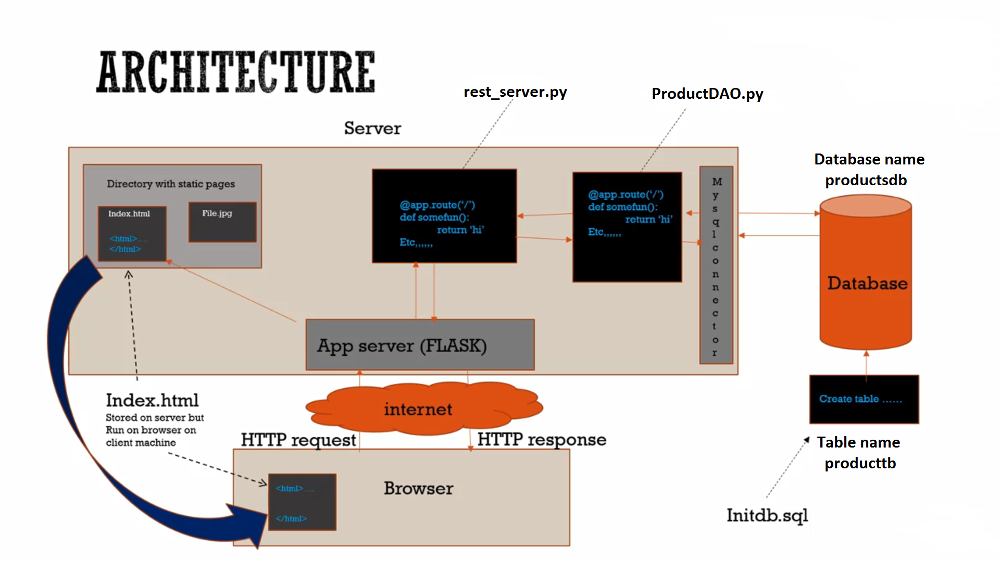

# Project Data Presentation
***
## Project Overview

 
 The Project contains a Product web application on a Flask server what has a RESTful API. The RESTful API is connected to a “MySQL” database where the data are stored. From the “index.html” website I carry out some CRUD operations on the data. CRUD stands for Create, Read, Update and Delete. 
   

### What is a Flask server?
An App server is a program running somewhere on the Internet what is serving out content. A webserver serves out just static pages and an app server like Flask will receive an HTTP requests and give an HTTP responses. It won’t give out just static pages it will also run functions for are particular requests from the code. 
  

### What is a RESTful API?
A RESTful API is an application program interface that constraints of the REST architectural style and allows for interaction with RESTful web services. REST stands for representational state transfer. It use for communication the HTTP protocol only.
  

## Project Installation
The project uses the Python package [Python](https://www.python.org/downloads/) and the database package [MYSQL](https://www.mysql.com/products/workbench/). It can run on different operation systems. Some additional python packages and libraries are required to run the application. The best way to install the python packages using "pip". Please find a list of additional packages and libraries on the requirements.txt file. The application is running in any web browser.
***
 

## How to run this application

1. Download and Install [Anaconda](https://www.anaconda.com/) or install [Python](https://www.python.org/downloads/)

2. Install the database package [MYSQL](https://www.mysql.com/products/workbench/). 

3. Additional packages listed in the requirements.txt file. To install the additional packages use the python "pip" command.

4. Download and Install [Commander](https://cmder.net/) for your Operation System (optional)

5. Insert the path where the application files are located

6. To run the application in the virtual environment type into the console or Commander ".\venv\Scripts\activate.bat ".

7. Run the Flask server from the console or Commander use the following command " python rest_server.py "

8. If the Flask server is running the IP Address with port number 5000 like http://127.0.0.1:5000/  appears.

9. Open any web browser on your machine and type in the IP Address of the Flask server followed by the index.html file http://127.0.0.1:5000/index.html      
     

***
 

## Setting up database in MySQL
* use the commented code in the ProductDAO.py file to set up a database called productdb and the database table producttb

* set up the productdb database and the producttb table directly with SQL commands ("CREATE DATABASE productsdb") for the database and "CREATE TABLE producttb (productid INT NOT NULL AUTO_INCREMENT PRIMARY KEY, productname VARCHAR(250), manufacturer VARCHAR(250), price float, vendorid VARCHAR(250)) for the database table
   

***
 

## Carrying out CRUD operation
 
 Open up any web browser and type in the following IP Address   

http://127.0.0.1:5000/index.html

### CREATE

Click on the Create Button on the index web site. A display / edit form appears. Fill out the table values for Product Name, Manufacturer, Vendor Id as string data type and Product Id and Price as integer data type. By pressing the Create Button the table values will be send to the database and the table values will be displayed in the product table.
  

### READ

When you open up the index web site or changes are made on the database, the values from the database will be called up and displayed.
  

### UPDATE

Click on the Update Button on a table row for a certain product. The display / edit form appears. Change any value in the table form. By pressing the Update Button the updated table values will be send to the database and the updated table values will be displayed in the product table. <b>The Product Id can not be changed.
  

### DELETE

Click on the Delete Button on a table row for a certain product. By pressing the Delete Button the product in the database will be deleted and removed from the product table.
  

***
 

## References

Anaconda: https://www.anaconda.com/ 

Python: https://www.python.org/downloads/

Commander: https://cmder.net/
  

***
### Data Presentation Project 
Silvio Dunst 

